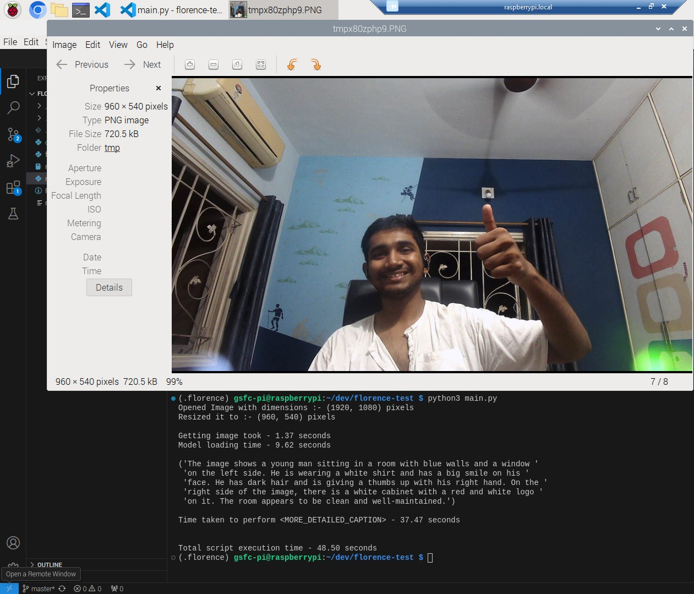
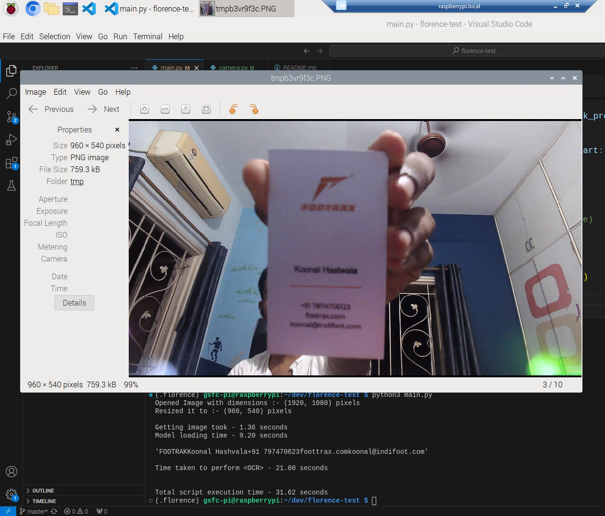

# Using Microsoft FLORENCE 2 Base Model on Raspberry Pi 5

## Results
Model loading time into memory is usually 10-12 seconds

"CAPTION" takes around 18-20 seconds

"DETAILED_CAPTION" takes around 30-34 seconds

"MORE_DETAILED_CAPTION" takes 38-60 seconds

Akshi Camera + MORE_DETAILED_CAPTION

Akshi Camera + OCR

## TODO

- [ ] Load Model and Image in Parallel
- [x] Add camera support
- [ ] Play with code in `florence_model.py` and explore different parameters
- [ ] Benchmark Captioning and OCR with different images
